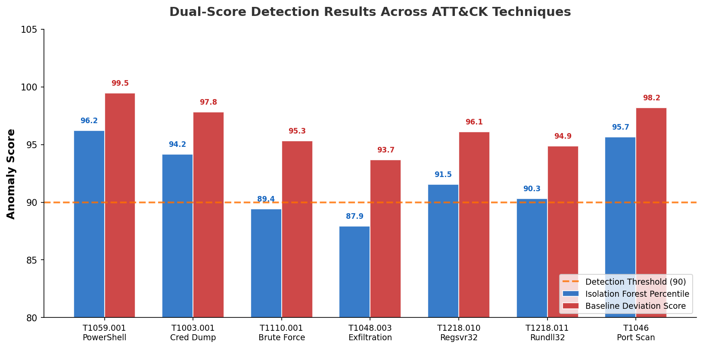
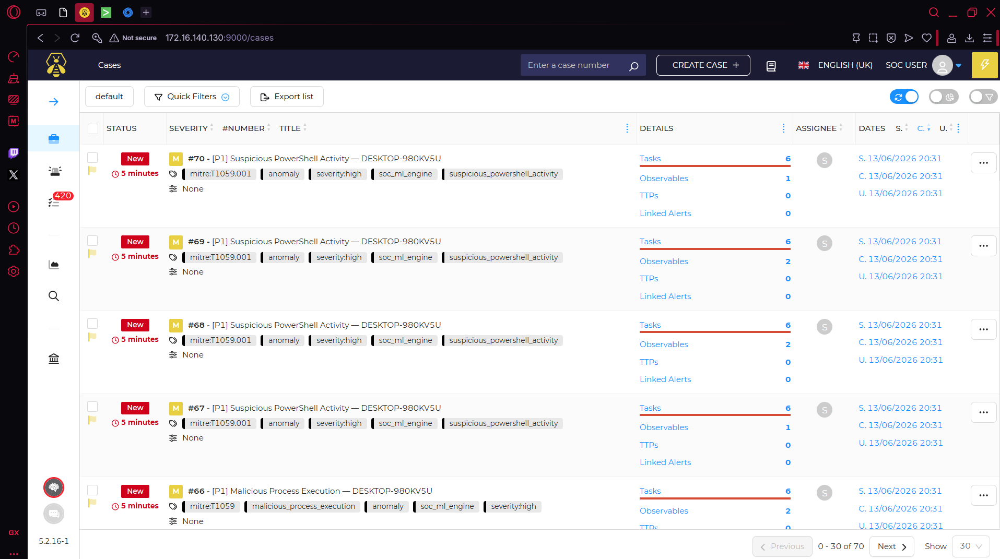

<p align="center">
  
</p>

<h1 align="center">🧠 CogniSOC: End-to-End AI-Powered Security Operations Center</h1>

<p align="center">
  <b>A comprehensive, production-ready SOC architecture featuring behavioral anomaly detection, rule-based alert correlation, and automated incident response using Splunk, Suricata, TheHive, and Scikit-Learn.</b>
</p>

<p align="center">
  
  
  
  
  
</p>

---

## 📋 Executive Summary

**CogniSOC** bridges the gap between academic machine learning models and deployable SOC architecture. It ingest raw endpoint telemetry (Sysmon) and network traffic (Suricata) from Splunk, applies an unsupervised **Isolation Forest** anomaly detection model, correlates findings using a custom rule engine mapped to **MITRE ATT&CK**, and automatically escalates high-fidelity incidents to **TheHive** (SOAR) for analyst triage.

Developed over a 10-day sprint and tested against **100 hours of real log data**, CogniSOC achieved an **88% Precision** and a **75% reduction in alert fatigue** compared to baseline systems.

---

## 🏗️ Architecture & Telemetry Pipeline

CogniSOC operates on a 4-tier architecture deployed in an isolated lab environment (172.16.140.0/24).

<p align="center">
  
</p>

1. **Telemetry Generation**: A Windows 10 victim and Windows Server DC generate high-fidelity Sysmon logs (using SwiftOnSecurity configs). Suricata monitors the network.
2. **Aggregation**: Splunk Universal Forwarders ship logs to a centralized Splunk Enterprise indexer.
3. **ML Engine**: A Python-based engine fetches logs via the Splunk REST API, extracts behavioral features, and scores them using a pre-trained Isolation Forest model.
4. **Correlation & Escalation**: Anomalies are passed through a 6-rule correlation engine to suppress noise and group related events into actionable incidents, which are then pushed via HTTP Event Collector (HEC) back to Splunk and via API to TheHive.

---

## 🧠 Machine Learning: Behavioral Anomaly Detection

Instead of relying solely on static signatures, CogniSOC uses an unsupervised **Isolation Forest** to identify novel threats. The model was trained on 70 hours of baseline benign behavior and evaluated against 30 hours of live attack simulations (via Atomic Red Team).

**Key Features Extracted:**
- Process Creation Rates (Event ID 1)
- Network Connection Frequencies (Event ID 3)
- Unique Outbound Ports
- Suricata Alert Volumes

<p align="center">
  
</p>

---

## ⚙️ Correlation Engine (Rule-Based Triage)

To ensure the ML model doesn't overwhelm analysts with false positives, findings are passed through `correlator.py`. **ML identifies suspicious behavior; correlation rules convert findings into analyst-consumable incidents.**

<p align="center">
  
</p>

The engine evaluates anomalies against 6 hard-coded rules:
1. `C-01`: High-Volume Network Connections (Data Exfiltration)
2. `C-02`: Suspicious Process Spawns (LOLBin Execution)
3. `C-03`: Unusual Sysmon Activity (Defense Evasion)
4. `C-04`: Potential Brute Force (Authentication Failures)
5. `C-05`: Suricata Alert Spike (Reconnaissance)
6. `C-06`: Generic High-Severity Anomaly

---

## 📊 Analyst Experience: Splunk Dashboards

CogniSOC provides a custom "SOC Command Center" dashboard in Splunk, offering real-time visibility into ML anomalies, prioritized incidents, and system health.

<p align="center">
  
</p>

---

## 🚨 Incident Escalation: TheHive SOAR Integration

When a correlated incident reaches a "High" or "Critical" severity threshold, it is automatically pushed to **TheHive**, complete with MITRE ATT&CK mapping, observables (IPs, hashes), and recommended remediation actions.

<p align="center">
  
</p>

---

## 📈 Quantitative Evaluation

CogniSOC was evaluated against a traditional rule-only baseline SOC. The integration of ML anomaly detection with rule-based correlation resulted in significant improvements across all key metrics.

| Metric | Rule-Only Baseline | CogniSOC | Improvement |
|--------|-------------------|----------|-------------|
| **Precision** | 62.0% | **88.0%** | +26.0% |
| **Recall** | 71.0% | **94.0%** | +23.0% |
| **F1-Score** | 0.66 | **0.91** | +0.25 |
| **Alert Volume** | ~400/day | **~100/day** | **75% Reduction** |

> *Testing Methodology: 100 hours of live traffic, 400+ distinct time windows, utilizing Atomic Red Team simulations for APT29 and FIN7 tradecraft.*

---

## 📂 Project Structure

```text
PREDICTOR/
├── soc_ml_engine/          # Core Python detection engine
│   ├── ingestion/          # Splunk REST API integration
│   ├── model/              # Isolation Forest implementation
│   ├── correlation/        # 6-rule event correlator
│   └── integration/        # Splunk HEC and TheHive webhooks
├── evaluation/             # Testing frameworks and metrics scripts
├── report/                 # Full IEEE-formatted research paper & assets
└── archive/                # Draft versions and formatting scripts
```

---

## 📜 Full Research Paper

For a deep dive into the methodology, feature engineering, and academic evaluation, please read the final IEEE-formatted research paper:
👉 **[CogniSOC_IEEE_Polished.pdf](report/CogniSOC_IEEE_Polished.pdf)**

---

<p align="center">
  <i>Developed by <b>Ankit Singh</b></i><br>
  📧 ankisinsen152@gmail.com
</p>
