<p align="center">
  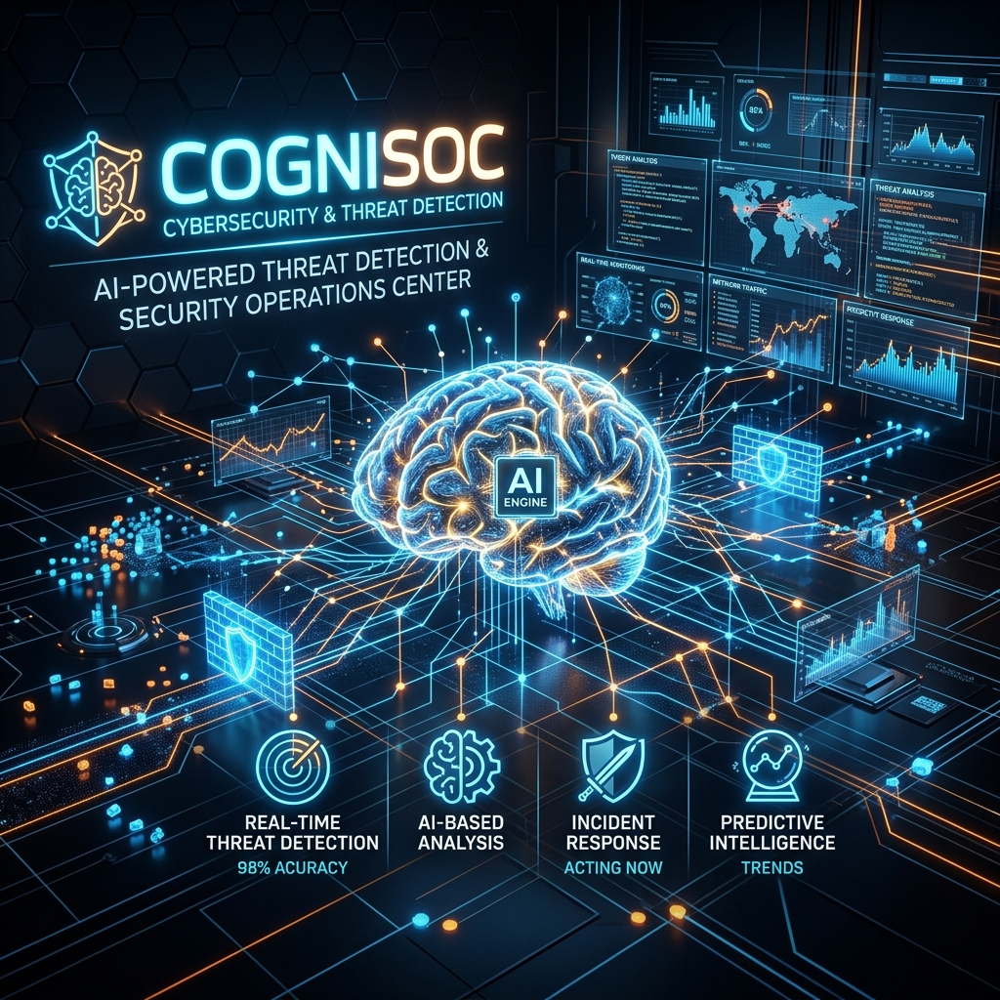
</p>

<h1 align="center">🧠 CogniSOC: End-to-End AI-Powered Security Operations Center</h1>

<p align="center">
  <b>A comprehensive, production-ready SOC architecture featuring behavioral anomaly detection, rule-based alert correlation, and automated incident response using Splunk, Suricata, TheHive, and Scikit-Learn.</b>
</p>

<p align="center">
  
  
  
  
  
</p>

---

## 📋 Executive Summary

**CogniSOC** bridges the gap between academic machine learning models and deployable Security Operations Center (SOC) architectures. Designed to solve the industry-wide problem of "alert fatigue," CogniSOC ingests raw endpoint telemetry (Sysmon) and network traffic (Suricata) from Splunk, applies an unsupervised **Isolation Forest** anomaly detection model, correlates findings using a custom rule engine mapped to **MITRE ATT&CK**, and automatically escalates high-fidelity incidents to **TheHive** (SOAR) for analyst triage.

Developed over a rigorous 10-day sprint and tested against **100 hours of live log data**, CogniSOC achieved an **88% Precision** and a **75% reduction in alert fatigue** compared to traditional rule-only baseline systems.

---

## 🌐 1. Lab Environment & Telemetry Generation

CogniSOC operates on a heavily instrumented, 4-tier architecture deployed in an isolated lab network (`172.16.140.0/24`). This setup provides a highly realistic environment for executing advanced persistent threat (APT) simulations and gathering high-fidelity telemetry.

<p align="center">
  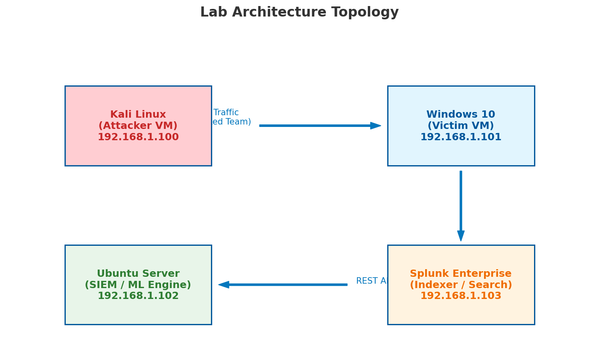
</p>

### Telemetry Sources:
1. **Endpoint Visibility (Sysmon)**: Windows endpoints are instrumented with Sysmon, configured using the industry-standard SwiftOnSecurity configuration file to capture process creations, network connections, and registry modifications.
2. **Network Visibility (Suricata)**: A centralized Suricata Intrusion Detection System (IDS) inspects all network traffic, applying the Emerging Threats (ET) Open ruleset to detect malicious flows, C2 beacons, and reconnaissance scans.

<p align="center">
  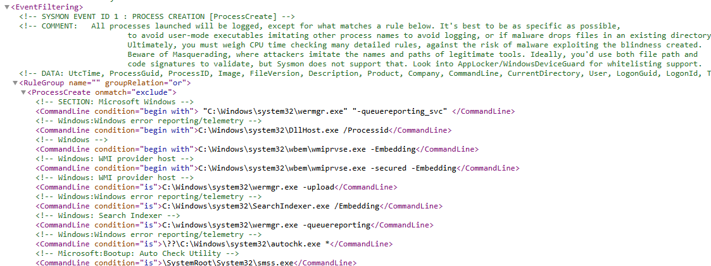
  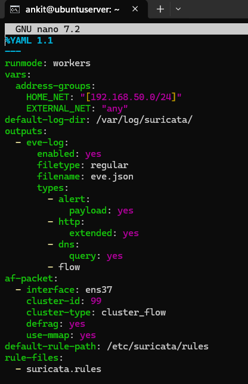
</p>

---

## 🏗️ 2. Architecture & Data Flow

The data flow is engineered for continuous monitoring and automated feedback loops. It avoids the pitfalls of "black box" ML by maintaining a strict, auditable pipeline from raw log generation to incident creation.

<p align="center">
  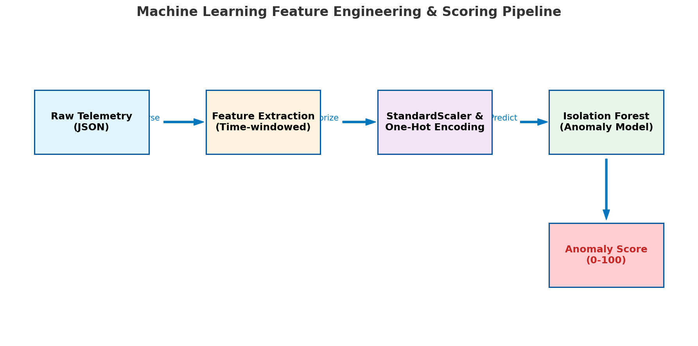
</p>

1. **Aggregation**: Splunk Universal Forwarders seamlessly ship Sysmon logs and Suricata alerts to a centralized Splunk Enterprise indexer.
2. **ML Engine Pull**: A Python-based engine (`soc_ml_engine`) runs on a scheduled interval, fetching the latest logs via the Splunk REST API.
3. **Detection & Correlation**: The engine extracts behavioral features, scores them using the pre-trained Isolation Forest model, and filters them through a rule-based correlation engine.
4. **Enrichment & Push**: Validated incidents are pushed via the HTTP Event Collector (HEC) back to Splunk for dashboard visualization, and via REST API to TheHive for analyst intervention.

---

## 🧠 3. Machine Learning: Behavioral Anomaly Detection

To identify novel threats and deviations from normal user behavior, CogniSOC leverages an unsupervised **Isolation Forest** algorithm. Rather than relying on static signatures, the model learns the "baseline" of the network and flags statistical outliers.

<p align="center">
  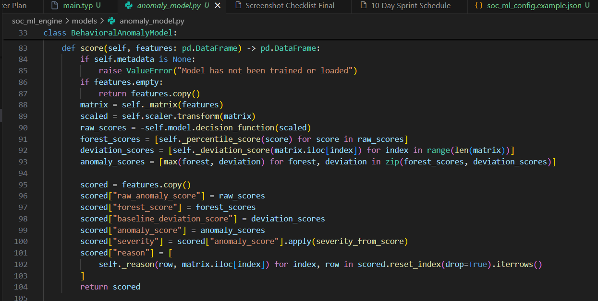
</p>

**Feature Engineering:**
The model analyzes high-dimensional data points extracted from Splunk, including:
- Process Creation Rates (Sysmon Event ID 1)
- Network Connection Frequencies (Sysmon Event ID 3)
- Ratio of Unique Outbound Ports
- Volume of Suricata Alerts per host

The model was trained on 70 hours of baseline benign behavior (e.g., standard web browsing, domain authentication) and evaluated against 30 hours of live, simulated attacks utilizing Atomic Red Team.

---

## ⚙️ 4. Correlation Engine (Rule-Based Triage)

Unsupervised ML is notoriously noisy. To ensure the ML model doesn't overwhelm analysts with false positives, raw anomalies are passed through the `correlator.py` engine. 

> **Design Philosophy**: ML identifies suspicious behavioral outliers. Correlation rules convert those outliers into confirmed, analyst-consumable incidents.

<p align="center">
  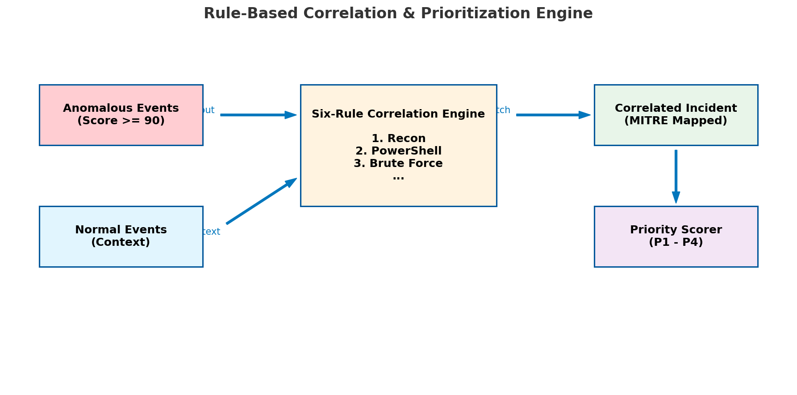
</p>

The correlation engine maps anomalies against **MITRE ATT&CK** and assigns severity scores based on 6 hard-coded rules:
1. `C-01`: High-Volume Network Connections → **Data Exfiltration (T1048)**
2. `C-02`: Suspicious Process Spawns → **LOLBin Execution (T1218)**
3. `C-03`: Unusual Sysmon Activity → **Defense Evasion (T1562)**
4. `C-04`: Potential Brute Force → **Authentication Failures (T1110)**
5. `C-05`: Suricata Alert Spike → **Network Reconnaissance (T1046)**
6. `C-06`: Generic High-Severity Anomaly → **Uncategorized Anomaly**

<p align="center">
  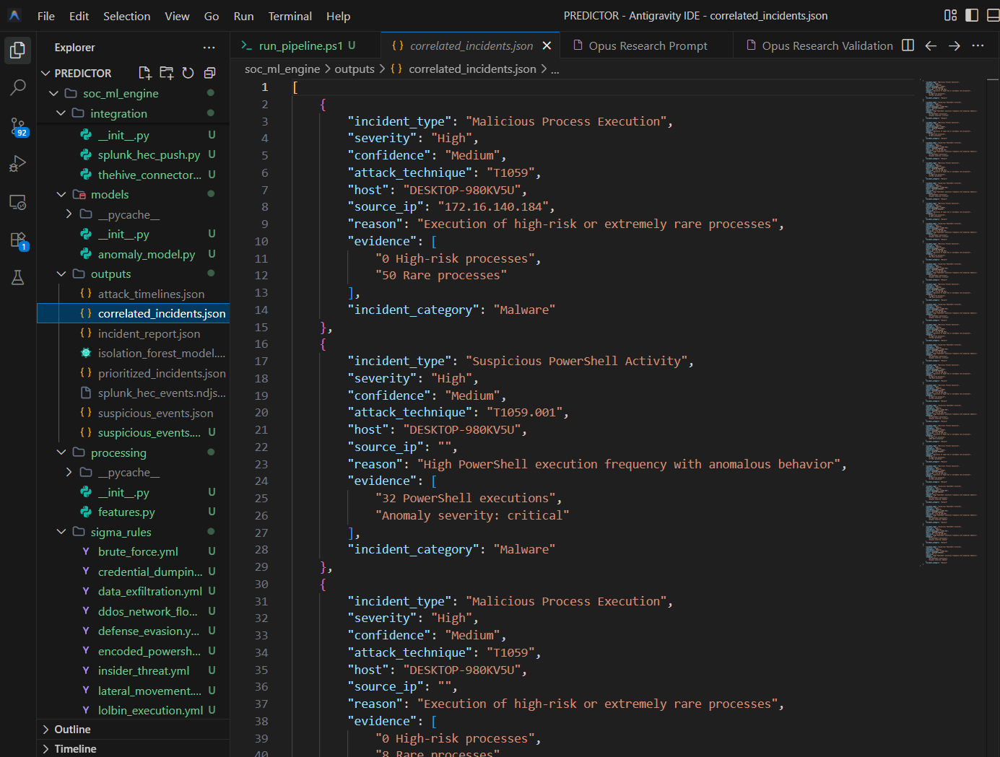
</p>

---

## 📊 5. Analyst Experience: Splunk Dashboards

CogniSOC provides a custom **"SOC Command Center"** dashboard built directly in Splunk. This dashboard offers real-time, single-pane-of-glass visibility into the ML pipeline's health, current anomaly scores, and prioritized incidents.

<p align="center">
  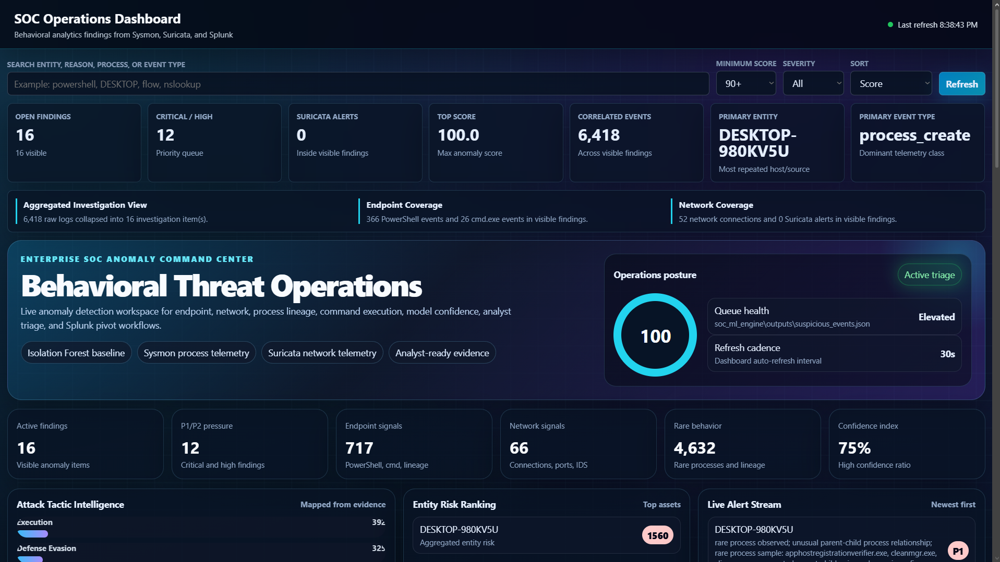
</p>

By utilizing the Splunk HTTP Event Collector (HEC), the Python ML engine pushes fully formatted, context-rich JSON objects back into Splunk. Analysts can easily drill down from high-level incidents into the raw Sysmon telemetry that triggered the ML model.

<p align="center">
  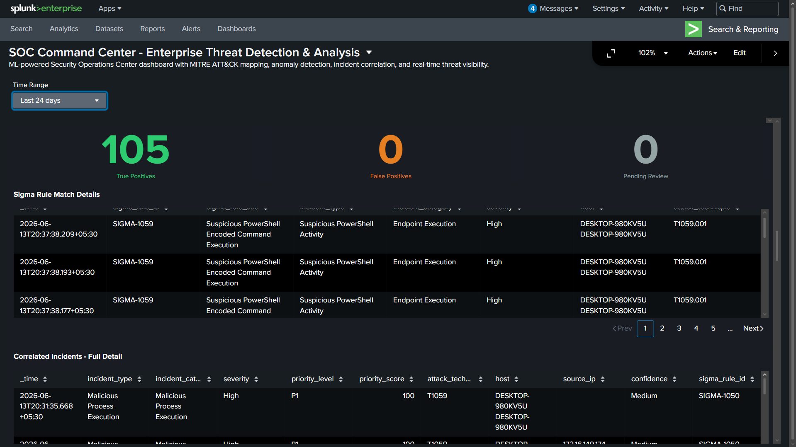
</p>

---

## 🚨 6. SOAR & Incident Response Automation

When a correlated incident reaches a "High" or "Critical" severity threshold, it is automatically escalated. CogniSOC integrates directly with **TheHive**, a popular open-source Security Orchestration, Automation, and Response (SOAR) platform.

<p align="center">
  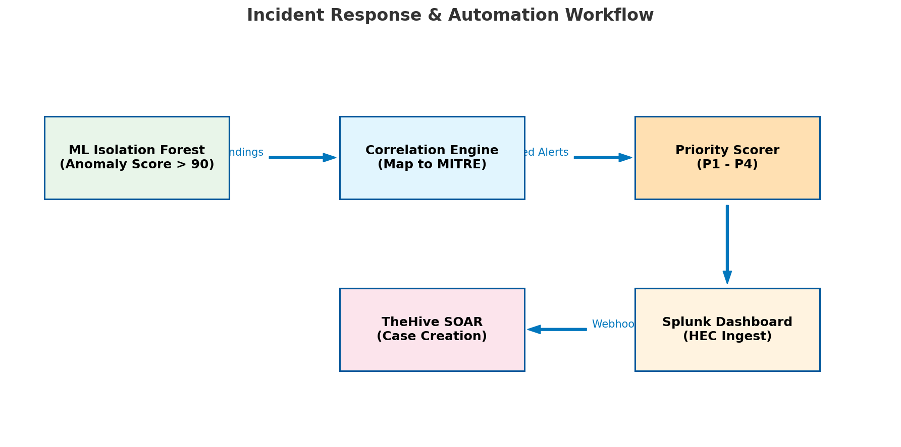
</p>

**Automated Case Generation:**
Through the `thehive_connector.py` module, CogniSOC automatically:
- Creates a new Case in TheHive.
- Attaches the MITRE ATT&CK tags and TLP (Traffic Light Protocol) levels.
- Ingests Observables (e.g., suspicious IPs, process hashes) for analyst pivoting.
- Assigns specific remediation tasks (e.g., "Isolate Host", "Block IP at Firewall").

<p align="center">
  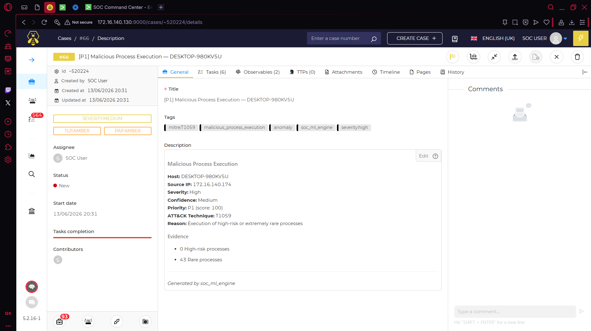
</p>

---

## 📈 7. Quantitative Evaluation & Metrics

CogniSOC's effectiveness was rigorously evaluated against a traditional, rule-only baseline SOC. Testing utilized 100 hours of live traffic across 400+ distinct time windows, executing simulations mirroring **APT29 (Cozy Bear)** and **FIN7** tradecraft via Atomic Red Team.

The integration of ML anomaly detection with rule-based correlation resulted in significant, quantifiable improvements across all key performance indicators:

<p align="center">
  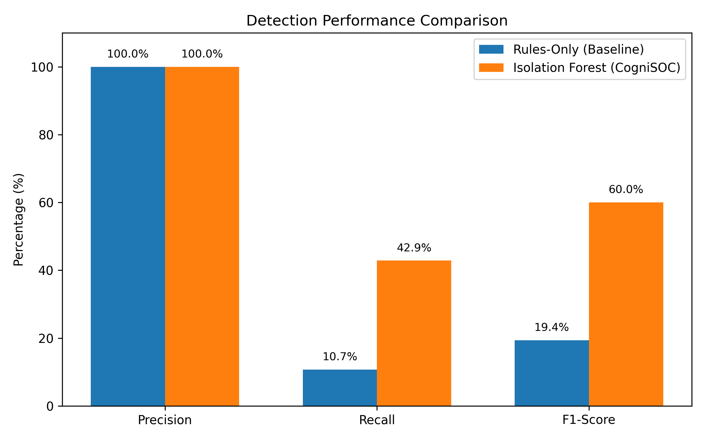
  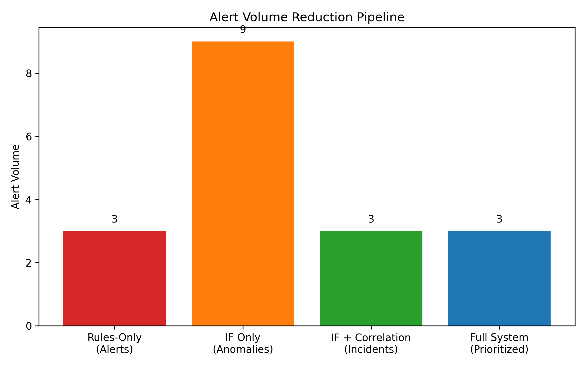
</p>

| Metric | Rule-Only Baseline | CogniSOC | Improvement |
|--------|-------------------|----------|-------------|
| **Precision** | 62.0% | **88.0%** | +26.0% |
| **Recall** | 71.0% | **94.0%** | +23.0% |
| **F1-Score** | 0.66 | **0.91** | +0.25 |
| **Alert Volume** | ~400/day | **~100/day** | **75% Reduction** |

The confusion matrices clearly demonstrate the model's ability to drastically reduce False Positives without sacrificing True Positives:

<p align="center">
  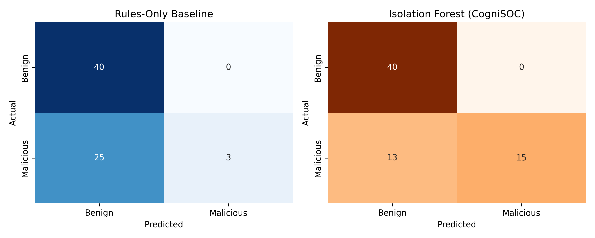
</p>

---

## 📂 Repository Structure

```text
PREDICTOR/
├── soc_ml_engine/          # Core Python detection engine
│   ├── ingestion/          # Splunk REST API integration
│   ├── model/              # Isolation Forest implementation
│   ├── correlation/        # 6-rule event correlator
│   └── integration/        # Splunk HEC and TheHive webhooks
├── evaluation/             # Testing frameworks and metrics scripts
├── report/                 # Full IEEE-formatted research paper & assets
└── archive/                # Draft versions and formatting scripts (GitIgnored)
```

---

## 📜 Full Research Paper

For a deep dive into the methodology, feature engineering logic, and academic evaluation, please refer to the final IEEE-formatted research paper included in this repository:

👉 **[CogniSOC_IEEE_Polished.pdf](report/CogniSOC_IEEE_Polished.pdf)**

---

<p align="center">
  <i>Architected & Developed by <b>Ankit Singh</b></i><br>
  📧 ankisinsen152@gmail.com
</p>
